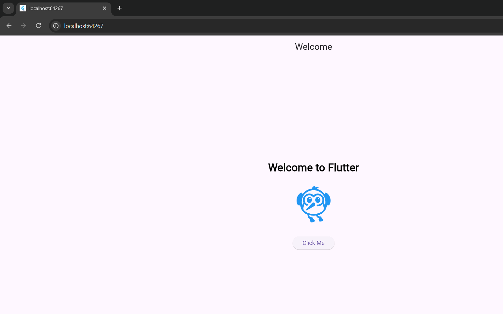
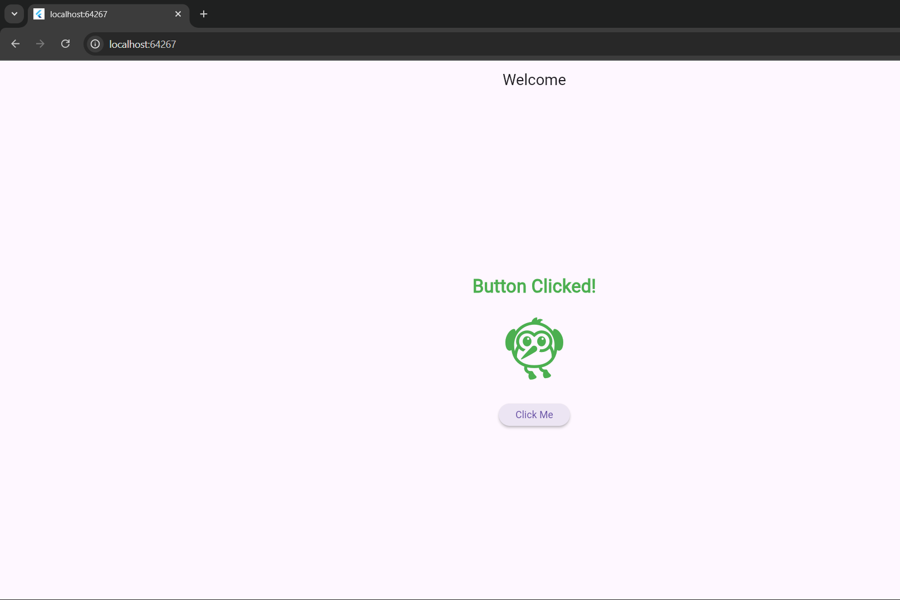

# 📘 Student Tracker

## 📱 Project Description
**Student Tracker** is a Flutter-based mobile application prototype aimed at helping students—especially those in **rural areas**—easily track their **academic performance and attendance** in their respective institutions.

The goal of this project is to create a **simple, accessible, and user-friendly interface** that can later be expanded into a full-fledged student management system. This initial version focuses on implementing a **Welcome Screen UI**, which demonstrates Flutter’s core concepts such as widget layout, state management, and user interaction.


## 📂 Folder Structure

```text
student_tracker/
│
├── lib/
│   └── main.dart
│
├── web/
├── windows/
├── test/
│
├── pubspec.yaml
├── README.md
📁 Folder Explanation
lib/

Contains all Dart source code for the application.

main.dart is the entry point where the Welcome Screen UI is built.

web/

Allows the Flutter app to run in a web browser (Chrome).

Used in this project to run the app without Android Studio.

windows/

Enables running the app as a Windows desktop application.

test/

Contains testing files for unit and widget tests (not used in this prototype).

pubspec.yaml

Defines project metadata and manages dependencies.

README.md

Contains documentation about the project, setup, and learnings.

⚙️ Setup Instructions
✅ Prerequisites
Windows 10/11 (64-bit)

Git installed

Visual Studio Code installed

Flutter SDK installed

🚀 Install Flutter SDK
Download Flutter SDK from:

ruby
Copy code
https://flutter.dev/docs/get-started/install
Extract the SDK to:

makefile
Copy code
C:\Users\<your-username>\flutter-sdk
Add Flutter to your system PATH:

makefile
Copy code
C:\Users\<your-username>\flutter-sdk\bin
Verify installation:

bash
Copy code
flutter doctor
▶️ Run the Project (Without Android Studio)
Open the project directory:

bash
Copy code
cd student_tracker
Install dependencies:

bash
Copy code
flutter pub get
Run the app on Chrome:

bash
Copy code
flutter run -d chrome
OR run as a Windows desktop app:

bash
Copy code
flutter run -d windows
🧠 Reflection & Learnings
📌 What I Learned About Dart & Flutter
Flutter follows a widget-based architecture, where every UI element is a widget.

StatelessWidget is used for static UI components.

StatefulWidget allows UI updates based on user interaction.

setState() is used to update the UI when the application state changes.

Flutter’s hot reload feature helps speed up UI development.

📌 How This Structure Helps Build Complex UIs Later
A clear folder structure keeps the project organized and scalable.

Breaking UI into widgets improves readability and reusability.

The Welcome Screen serves as a base for adding:

Attendance tracking screens

Academic dashboards

Authentication and navigation


🎯 Future Enhancements
Attendance marking and history

Academic performance dashboard

Offline data storage

Login system for students and teachers

Backend integration (Firebase / API)


## 🖼️ Screenshots

### Welcome Screen


### Button Clicked State
